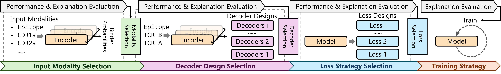

T cell receptor (TCR) recognition of peptide-MHC (pMHC) complexes is central to immunity and T cell-based therapies. We introduce an explanation-driven framework that uses a new post-hoc analysis method to guide the design of a novel encoder-decoder transformer for TCR-pMHC prediction. By revealing the most informative TCR-epitope features, our method optimizes cross-attention design, auxiliary objectives, and an explanation-based early-stopping strategy. The resulting model achieves state-of-the-art accuracy with improved robustness and interpretability, offering new insight into sequence-level binding mechanisms.

_The overall pipline of development of a multi-modal transformer model for TCR-pMHC binding prediction._