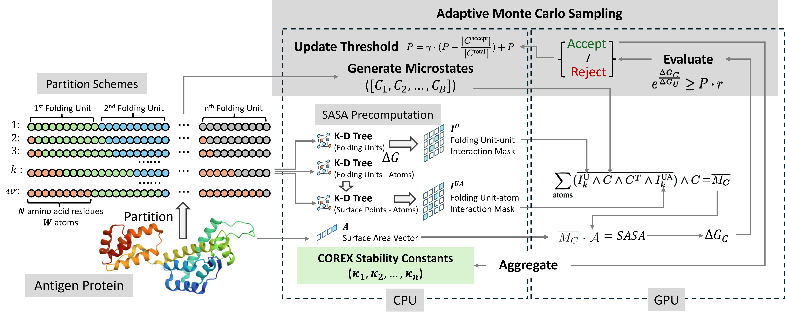

CD4+ T cells play a crucial role in adaptive immunity and are a significant component of immunological response in many settings. Computational prediction of which antigenic peptides are presented and bind to T cells is a problem that has been studied for several decades. Current efforts apply supervised learning methods to predict peptide-MHCII binding, but do not incorporate the role of antigen processing. To address this, our group developed the Antigen Processing Likelihood (APL) algorithm, which relies on a free energy-based conformational stability metric known as COREX. COREX requires the analysis of a potentially large conformational ensemble and is thus computationally intensive. In recent prior work, we parallelized this analysis with an algorithm we called pCOREX. pCOREX reduced the computation time from hours/days to minutes, demonstrating a near-ideal speedup on 192 CPU cores. In this paper, we achieve an even more substantial acceleration of the COREX algorithm by making use of GPU cores, and demonstrate a reduction in computation time from minutes to seconds



The GPUCOREX can be installed use command:
```bash
pip install gpucorex @ git+https://github.com/Jiarui0923/gpuCOREX@0.0.2
```